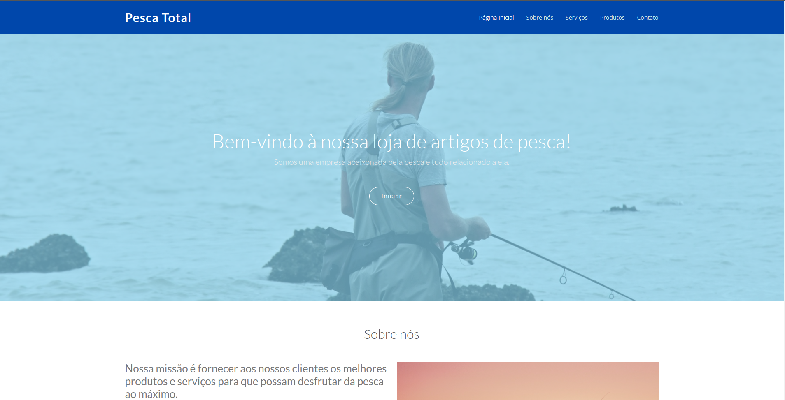

# Preencha aqui o título do projeto

> 1. Baixe este arquivo e edite o texto em formato Markdown conforme as instruções a seguir.
> 2. Substitua todos os blocos "Preencha aqui" por informações do seu projeto. 
> 3. Substitua a imagem por pelo menos um screenshot do projeto (arquivo pode ser armazenado no repositório ou em URL externa). GIFs animados também são permitidos!
> 4. Remova todas as instruções de entrega.
> 5. Double-check: Certifique-se de que seu README.md não contenha instruções de entrega!
> 6. Entregue este README.md dentro da pasta raiz do seu repositório de entrega. Peça ajuda se não souber como editar ou entregar!
> Opcional: você pode alterar a formatação do README, mas mantenha todas as informações solicitadas

.

Acesso: https://elc1090.github.io/project1-Felipeamadori

#### Desenvolvedor(a)
Felipe Machado

#### Cliente
Leonardo Krugel

#### Tecnologias

- HTML
- CSS
- Bootstrap
- JavaScript

#### Ambiente de desenvolvimento

- VS Code

#### Créditos

- URL de templates usados - https://bootstrapmade.com
- URL de icon kits usados - https://icons.getbootstrap.com
- URL de imagens usadas - https://pixabay.com/

#### Bastidores

Preencha aqui um breve relato dos bastidores e das particularidades do desenvolvimento do seu projeto, por exemplo: "match" com cliente, se houve mudança de objetivos/cliente/tecnologias durante o processo, algo marcante nas tecnologias usadas/aprendidas, se há mais de uma versão, se algo ficou faltando, se houve alguma parte mais trabalhosa de implementar, etc.

---
Projeto entregue para a disciplina de [Desenvolvimento de Software para a Web](http://github.com/andreainfufsm/elc1090-2023a) em 2023a